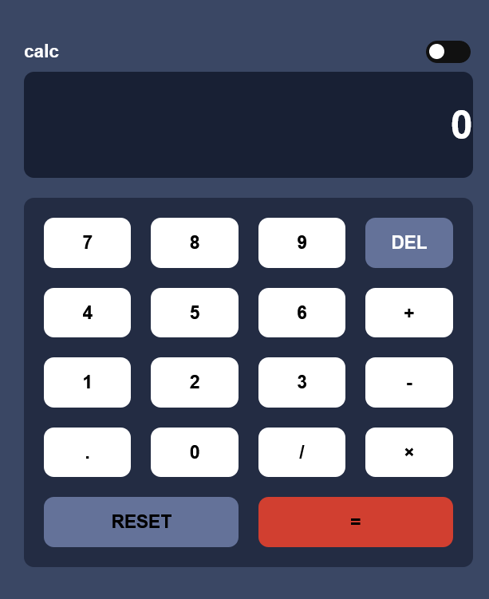

# Frontend Mentor - Calculator app


This is a solution to the [Calculator app challenge on Frontend Mentor](https://www.frontendmentor.io/challenges/calculator-app-9lteq5N29). Frontend Mentor challenges help you improve your coding skills by building realistic projects.


## Table of contents

- [Overview](#overview)
  - [The challenge](#the-challenge)
  - [Screenshot](#screenshot)
  - [Links](#links)
- [My process](#my-process)
  - [Built with](#built-with)
  - [What I learned](#what-i-learned)
  - [Continued development](#continued-development)
  - [Useful resources](#useful-resources)
- [Author](#author)


## Overview

### The challenge

Users should be able to:

- See the size of the elements adjust based on their device's screen size
- Perform mathmatical operations like addition, subtraction, multiplication, and division
- Adjust the color theme based on their preference

### Screenshot



### Links

- Solution URL: [Add solution URL here](https://your-solution-url.com)
- Live Site URL: [Add live site URL here](https://your-live-site-url.com)


## My process

### Built with

- Semantic HTML5 markup
- CSS custom properties
- Flexbox
- CSS Grid
- Desktop-first workflow


### What I learned
-This project helped sharpen my knowledge of semantic Html, CSS and Vanilla Javascript
-

some code snippets i am proud of? , see below:

```css

.checkbox:checked + .label .ball {
	transform: translateX(15px);
}

```
```js
const themeBody = document.getElementById("checkbox");

themeBody.addEventListener("change", (event) => {
    document.body.classList.toggle("dark");
});

```

### Continued development

I will take on more complex projects involving dom manipulation and functions in javascript as i see the success of this project as a stepping stone for better development.


### Useful resources

- (https://www.freecodecamp.org) - This helped me learm more abot the function of a calculator. I really liked this pattern and will use it going forward.
- (https://www.youtube.com/watch?v=xodD0nw2veQ) - This is an amazing article which helped me finally understand toggle in javascript. I'd recommend it to anyone still learning this concept.


## Author

- Frontend Mentor - (https://www.frontendmentor.io/profile/iraytee-code)
- Twitter - [@yourusername](https://www.twitter.com/EA_techofficial)


